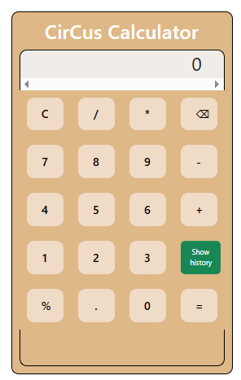

# React-Basic-Calculator

This project is built with React + Vite.

It provides a minimal setup to get React working in Vite with HMR and some ESLint rules.

Currently, two official plugins are available:

- [@vitejs/plugin-react](https://github.com/vitejs/vite-plugin-react/blob/main/packages/plugin-react/README.md) uses [Babel](https://babeljs.io/) for Fast Refresh
- [@vitejs/plugin-react-swc](https://github.com/vitejs/vite-plugin-react-swc) uses [SWC](https://swc.rs/) for Fast Refresh


# 🧮 React Basic Calculator Named "CirCus Calculator"

A simple calculator app built using React that performs basic arithmetic operations (add, subtract, multiply, divide).

## 🚀 Live Demo
Coming soon...

## 📦 Features

- Responsive UI
- Add, subtract, multiply, divide
- Clear and delete functions
- Built with React Hooks

## 🛠️ Technologies Used

- React
- CSS

## 📂 Getting Started

Clone the repo:

```bash
git clone https://github.com/RISkylollipop/React-Basic-Calculator.git
cd React-Basic-Calculator
npm install
npm run dev

## 📷 ScreenShot:
